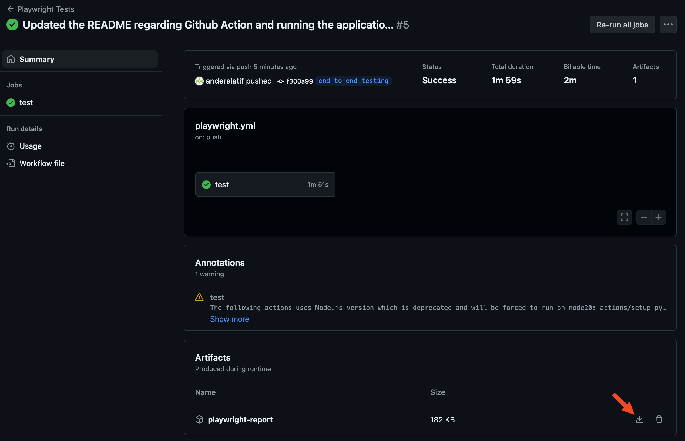

# Whoknows Variations

This branch focuses on end-to-end testing the Flask application using Playwright. The tests are located in the `src/test/e2e` directory.

---

## Initializing Playwright

Playwright has already been initialized in this repository. This section is if you want to start out fresh (you could do it in another folder in this very repository). Otherwise, jump to the next section.


Follow the tutorial from the documentation:

https://playwright.dev/docs/intro

As written in the documentation you can set it up (ensure that you are in the desired folder for where you want to test):

```bash
$ npm install -D playwright@latest
```

Once finished, the CLI provides the following suggestions:

```text
 npx playwright test
    Runs the end-to-end tests.

  npx playwright test --ui
    Starts the interactive UI mode.

  npx playwright test --project=chromium
    Runs the tests only on Desktop Chrome.

  npx playwright test example
    Runs the tests in a specific file.

  npx playwright test --debug
    Runs the tests in debug mode.

  npx playwright codegen
    Auto generate tests with Codegen.
```

---

## Running the default test

The default test in [demo-todo-app.spec.js](/src/tests/e2e/tests/demo-todo-app.spec.js) has been moved from the `src/test/e2e/tests-examples` folder where it was initialized to. This enables it to run. Look at the test and make sure you understand what it does. 

First `cd` to the `src/test/e2e` directory and install the node dependencies and install Plawright to get the different browser drivers: 

```bash
$ npm install
$ npx playwright install
```

Then run the tests with:

```bash
$ npx playwright test
```

You can get an UI overview of all the tests by running:

```bash
$ npx playwright test --ui
```

If you would like to see the tests being performed live, you can run the tests in `headed` mode (headless means no browser window is shown, and this is how end-to-end tests usually run):

```bash
$ npx playwright test --headed --project=chromium
```
Note that I specify it to only run in one browser, otherwise it will open a window for each browser.


You can alternatively run the tests in `debug` mode, which allows you to step through the tests:

```bash
$ npx playwright test --debug
```

Running the test in UI mode allows you to see the browser and the test in action. Run `npx playwright test --ui`.

---

## Making the tests run for `whoknows`

Feel free to move `demo-todo-app.spec.js` back to the `src/test/e2e/tests-examples` folder.

In [basic-functionality.spec.js](/src/tests/e2e/tests/basic-functionality.spec.js) you can recomment the test. 

The test requires our application to run. Make sure to run the Flask application. For instance, you could run `make run` in the `src` directory. 

It knows to call our project on `http://localhost:8080` because the config file has been changed. If you would like to update the base url and por, then find the baseURL key in `src/test/e2e/playwright.config.js`:

```js
import { defineConfig } from '@playwright/test';

export default defineConfig({
  testDir: './tests',
  use: {
    baseURL: 'http://localhost:8080',
  },
});
```

Now you can run the tests:

```bash
$ npx playwright test
```

You can view a report of the test results:

```bash
$ npx playwright show-report
```

---

## Github Actions

### Setup

The Playwright CLI setup process offers to create a Github Actions workflow. Note how the workflow [in this repository](.github/workflows/playwright.yml) has been modified, with the `working-directory` key, to reflect the project structure.

It makes sense in this repository to also change the trigger to this:

```yaml
on:
  push:
    branches: end-to-end_testing
  pull_request:
    branches: end-to-end_testing
```

Additional steps have been added to run the application on the runner so that the tests can be run against it.

### Report

You can download the report from the Github Actions workflow. The report is saved as an artifact. Click on download inside of the workflow run.



#### [Optional] Deploying the report to GH Pages

You must configure Github Pages in your repository settings. Here is how you do it:

1. Go to your repository on GitHub.
2. Click on the **Settings** tab.
3. In the left sidebar, click on **Pages**.
4. Under the **Source** section, select **gh-pages** branch from the dropdown menu and ensure the directory is set to **/root**.
5. Click **Save**.

Deploying over the `gh-pages` branch is the standard way to do it. 

Please have look at the [full example](./.github/workflows/playwright.yml). Here is the step to deploy the latest report to GH Pages:

```yaml
    - name: Deploy to GitHub Pages
      if: always()
      uses: peaceiris/actions-gh-pages@v3
      with:
        github_token: ${{ secrets.GITHUB_TOKEN }}
        publish_dir: src/tests/e2e/playwright-report
        publish_branch: gh-pages
```


Giving the workflow write permission is required for it to deploy to GH Pages:

```yaml
permissions:
  contents: write 
```

Beware that it can sometimes take a few minutes for Github to update GH Pages. Or your browser might cache the old version of the report.

The report should now be accessible at `https://<username>.github.io/<repository>`. 

For this repository the page is on `https://who-knows-inc.github.io/whoknows_variations`.

## Further considerations

You can record tests by running `npx playwright codegen`. This will generate a test file based on your interactions with the website.

Consider how you will create your test environment. Will you:

- Run the tests in the Github Action runner?
- Run the tests in a test environment before deploying?
- Run the tests after the website has been deployed?

Or maybe a combination of these options?
