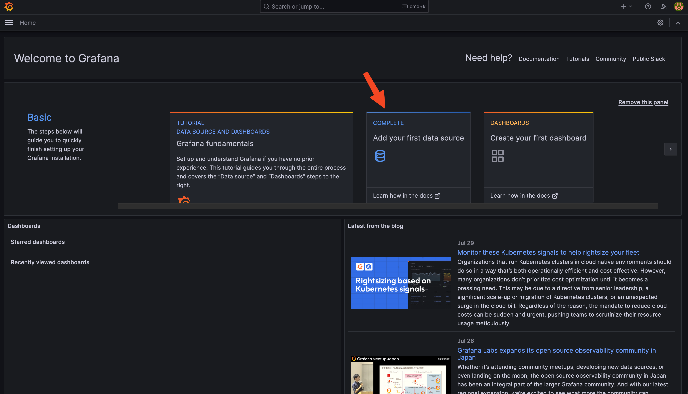
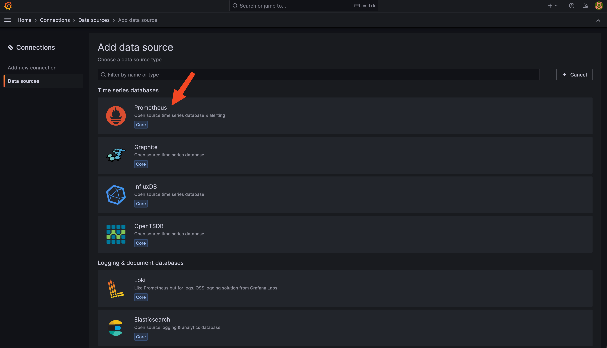
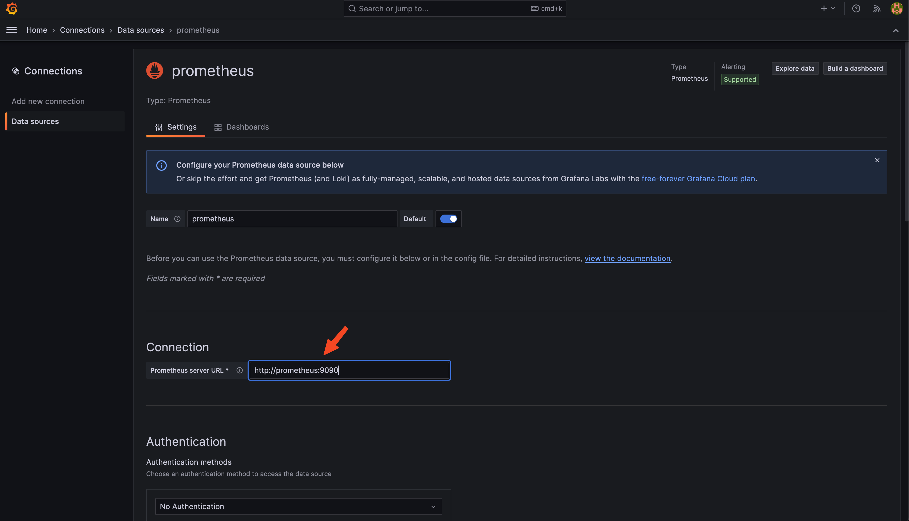
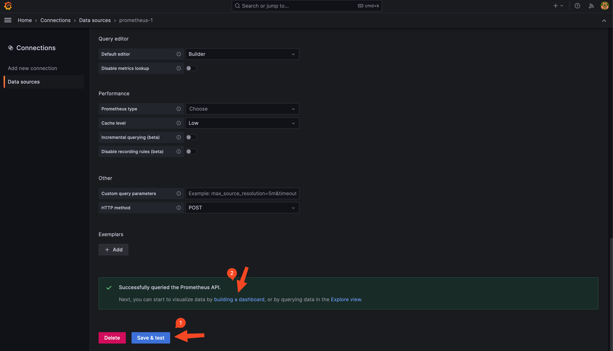
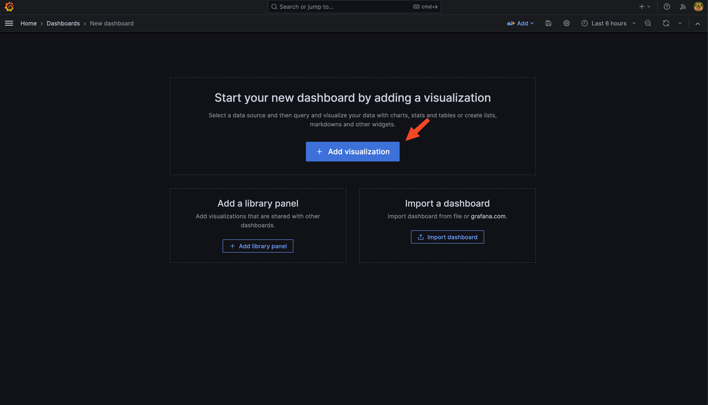
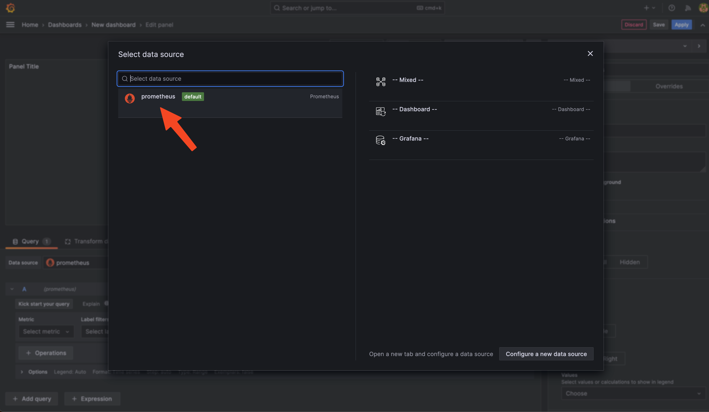
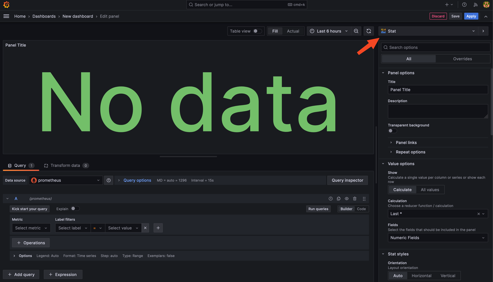
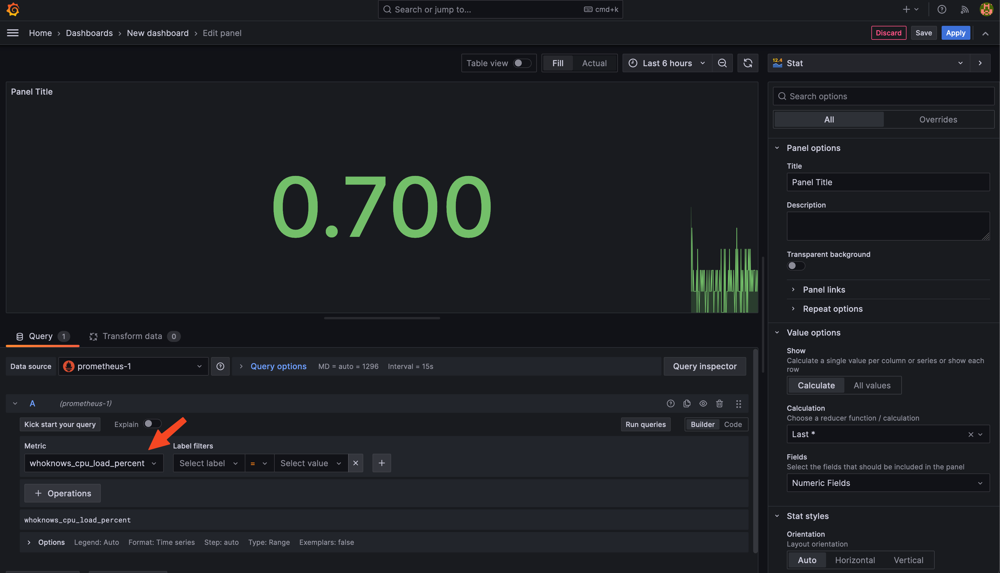
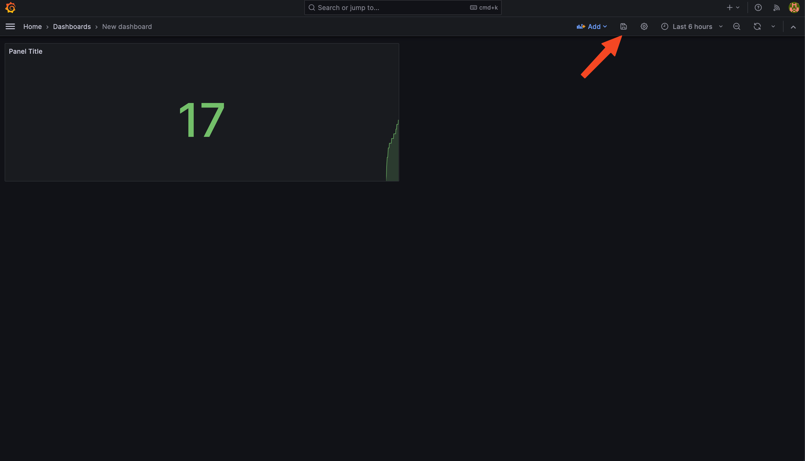
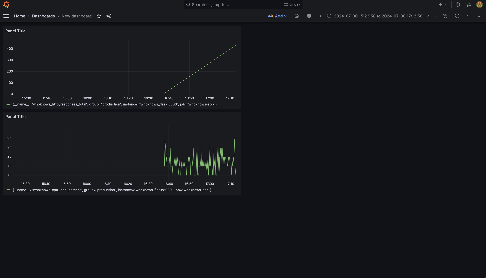

## Grafana

In your browser nagivate to http://localhost:3000/. The default login is `admin`/`admin`.

1. Click `Add your first data source`.



2. Select `Prometheus` as the data source.



3. Type http://prometheus:9090 in the URL field. Prometheus reflects the name of the service in the `docker-compose.yml` file.



4. Scroll down and click `Save & Test`. After you click, you should see the following message on the same page: `Successfully queried the Prometheus API`. In that case click on `building a dashboard`.



5. Click on `+ Add visualization`.



6. Change the default visualization type from `Time Series` to `Stat`. 



7. Search in the `Metrics` browser. Unlike the screenshot. You could search for `whoknows_cpu_load_percent`, `whoknows_http_responses_total` or `whoknows_request_duration_milliseconds`. These are the metrics that have been set up in `app.py`. 



8. Click `Apply`. (Step 2 in the image above)

9. To save the dashboard, click on the `Save` icon. Give the dashboard a name and click `Save`.



10. Click `Add` and `Visualization` to keep adding panels to the dashboard.





## Finding your dashboard

To find your dashboard click on the hamburger menu (three horizontal lines) in the top left corner and select dashboards. 

It would be convenient to set the dashboard to appear on the frontpage. Here is how you do it:

https://stackoverflow.com/questions/48164754/how-to-set-a-dashboards-on-grafana-home-page

## [Optional] Installing plugins for Grafana

If you would like to visualize the data in a different way than the default, you can install plugins for Grafana.

1. Go to the `Panel plugins for Grafana` page: https://grafana.com/grafana/plugins/panel-plugins/

2. Let's try it with this plugin: https://grafana.com/grafana/plugins/grafana-clock-panel/

3. First, log into (-it = interactive) the bash shell of the grafana instance. Verify it's name on your machine with `docker ps`. In my case it is `src-grafana-1`.:

```bash
$ docker exec -it src-grafana-1 /bin/bash
```

4. Once logged in run the install command, see the success message and typee `exit` to leave the shell:

```bash
04830e2291c1:/usr/share/grafana$ grafana cli plugins install grafana-clock-panel
✔ Downloaded and extracted grafana-clock-panel v2.0.1 zip successfully to /var/lib/grafana/plugins/grafana-clock-panel

Please restart Grafana after installing or removing plugins. Refer to Grafana documentation for instructions if necessary.
04830e2291c1:/usr/share/grafana$ exit
exit
```

The exact command can be found on the installation tab:

https://grafana.com/grafana/plugins/grafana-clock-panel/?tab=installation

5. Restart the Grafana service. In mycase, where it is named `src-grafana-1`:

```bash
$ docker restart src-grafana-1
```

6. After restarting the service, installed plugins should be available immediately. You always verify the installation by going to http://localhost:3000/plugins.

7. Go to your dashboard, click `Add` and `Visualization` and you should see the new plugin available. Search for `clock` and you should see the new plugin.


8. It's possible to style the background color, font size etc. in the options tab. 

9. Success! You have now installed a plugin for Grafana.

## Codify your creation

Make sure to turn your Grafana configuration into code, so that you do not go through the manual setup:

Search for "Grafana Predefined Dashboards":

https://runkiss.blogspot.com/2020/01/using-prometheus-grafana-to-monitor.html

Or you can build a custom Grafana image:

https://grafana.com/docs/grafana/latest/setup-grafana/configure-docker/#build-a-custom-grafana-docker-image 
