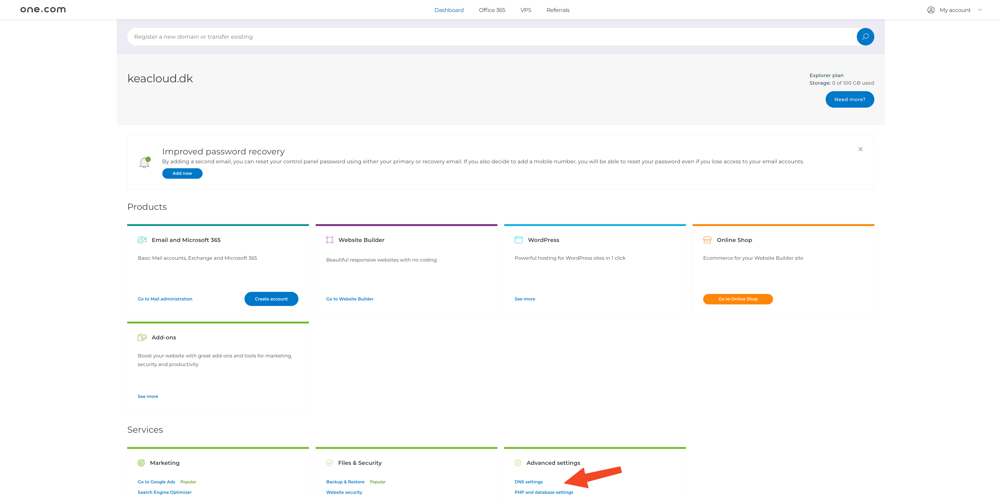
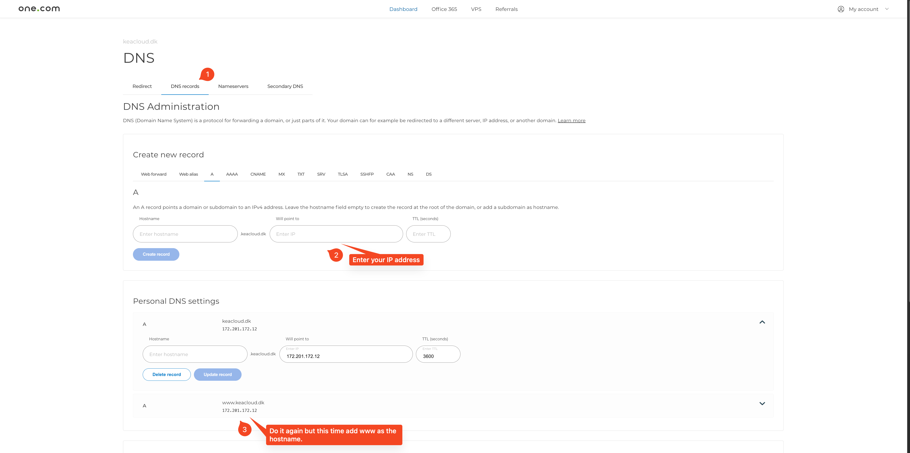

# Prerequisite: Have a server

If you don't already have a server running or if you would like to try this setup then create a server. 

Make sure that you have a public IP.

Make sure that port 80 and 443 are open.

You can do it with the following commands:

```bash
$ sudo ufw allow 80
$ sudo ufw allow 443
```

---

# Find the DNS setting

The DNS setting is tucked away at the bottom.



---

# Add the A record

Add the A record with the IP address of your server.



---

# Make sure that the A record is added

After a few minutes, make sure that the A record is added with the following command (from your local machine):

```bash
$ dig A <yourdomain.com> +short
```

