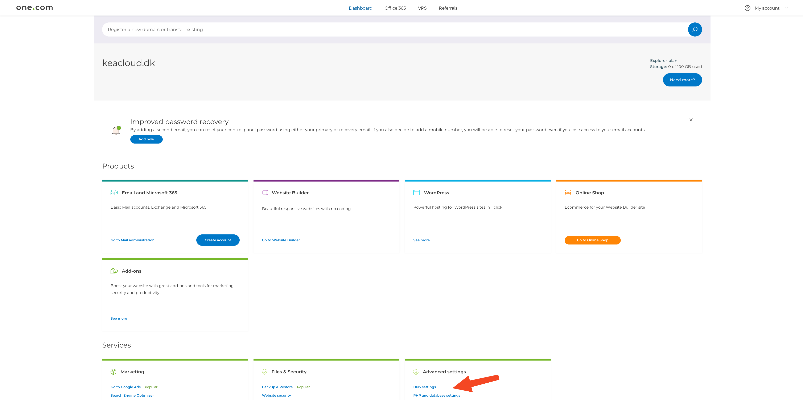
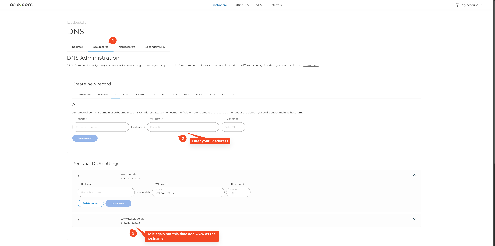

# Example domain

Throughout this tutorial series, the example domain is **`ekcloud.dk`**. Wherever you see `ekcloud.dk` — in commands, screenshots, or the committed config files — substitute the domain you registered in [tutorial 01](./01._registering_domains_with_one.com.md).

In this tutorial specifically, replace `<yourdomain.com>` in the `dig` commands and the A record values with your domain. The actual file edits (in [tls/nginx.conf](../tls/nginx.conf) and [tls/compose.yaml](../tls/compose.yaml)) are itemised in [tutorial 03](./03._running_it_on_the_server.md).

---

# Prerequisite: Have a server

If you don't already have a server running or if you would like to try this setup then create a server.

Make sure that you have a public IP.

Make sure that ports `80` and `443` are open inbound.

If you provisioned with the Terraform in [infrastructure/](../infrastructure/), the NSG in [network.tf](../infrastructure/network.tf) opens both. If you added `443` after the initial apply, re-run:

```bash
$ cd infrastructure
$ terraform apply
```

If your distro also has a host firewall enabled (e.g. `ufw` on Ubuntu), open the ports there too:

```bash
$ sudo ufw allow 80
$ sudo ufw allow 443
```

---

# Find the DNS setting

The DNS setting is tucked away at the bottom.



---

# Add the A records

Add an A record for the apex domain pointing to the public IP of your server.

| Type | Hostname / Subdomain | Value (IP)       | TTL     |
|------|----------------------|------------------|---------|
| A    | `@` (apex)           | `<your-server-ip>` | default |
| A    | `www`                | `<your-server-ip>` | default |

The `www` record is optional but recommended. If you skip it, leave `www.<yourdomain>` out of the certbot command in the next tutorial.



---

# Make sure that the A records are added

DNS can take a few minutes (sometimes longer) to propagate. From your local machine:

```bash
$ dig A <yourdomain.dk> +short
$ dig A www.<yourdomain.dk> +short
```

Replace `.dk` if you have a different TLD.

Both should return your server's IP before you continue.
