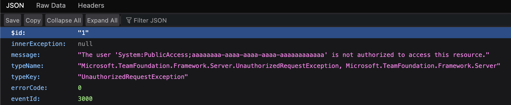
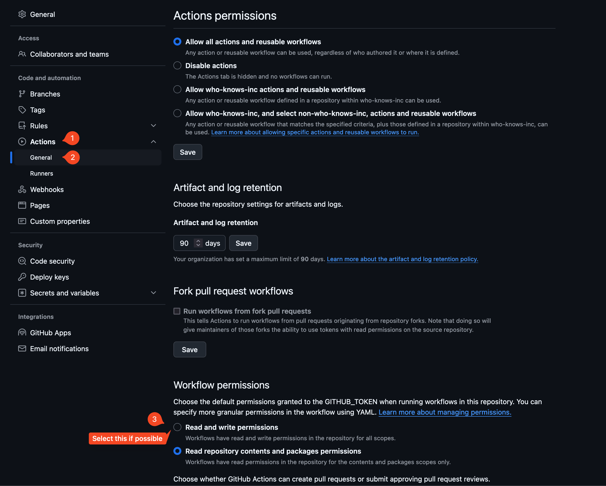
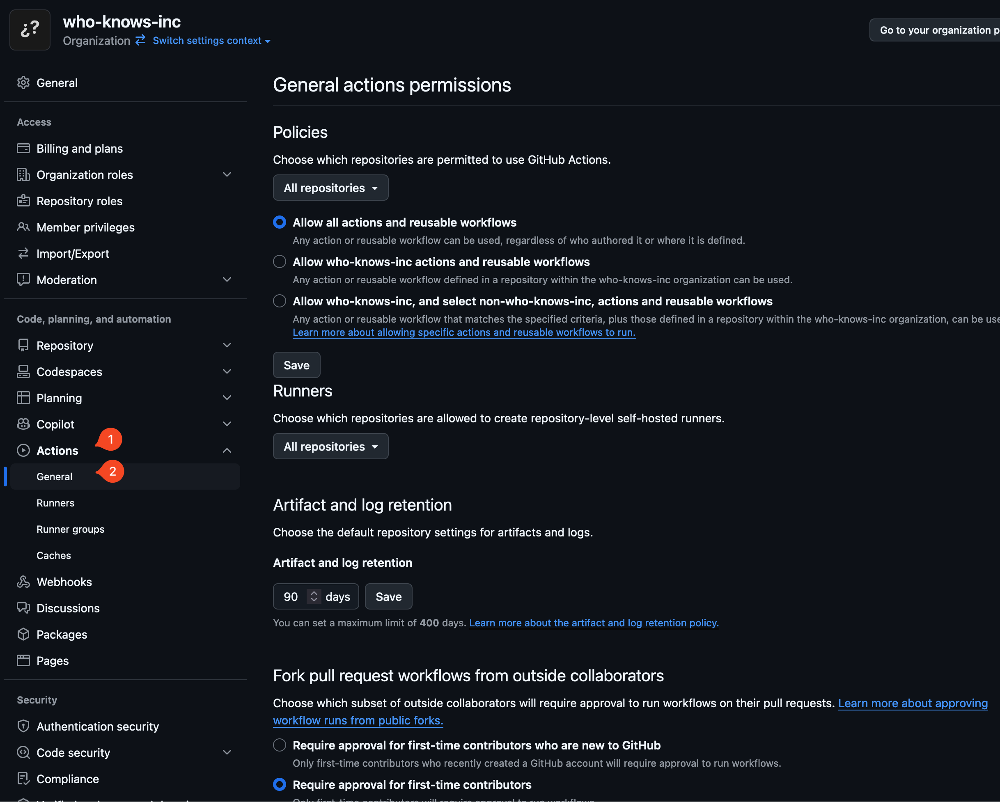
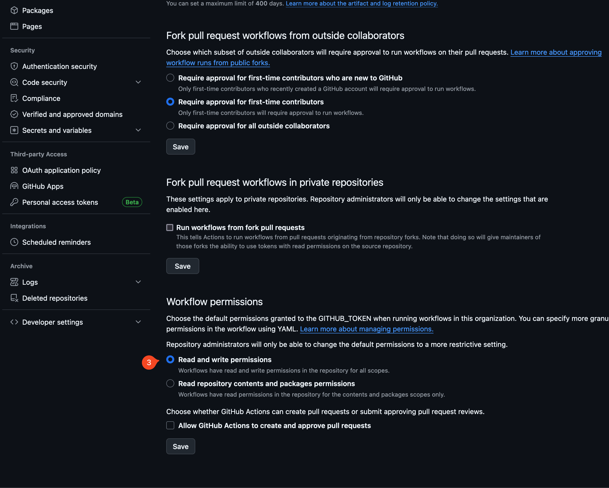

## What is `OWASP ZAP`?

[OWASP ZAP](https://www.zaproxy.org/) is a security tool that helps find security vulnerabilities in web applications. It is a widely used tool for security testing and is available as a standalone application or as a plugin for browsers. 

Unlike `bandit` and `safety`, `OWASP ZAP` requires the application to be running in order to scan it. 

Note that unlike `bandit`, OWASP ZAP will not fail because it doesn't look at the insecure code but at vulnerabilities as seen from the outside such as headers.

---

## The workflow file

The workflow file is named [owasp_zap.yml](../.github/workflows/owasp_zap.yml). It is a simple workflow that runs the application locally on the runner and then runs the OWASP ZAP scan on the application.

1. 

First part of the workflow is to install and run the application. Care is taken to ensure that the application is running before the scan starts. 

```yaml
    - name: Start the application
      run: |
        python src/backend/app.py &
        sleep 10  # Give the app time to start

    - name: Ensure the app is running
      run: |
        curl --retry 5 --retry-connrefused --retry-delay 5 http://localhost:8080
```

2.

The second part is the scan. 

Ideally, one could use the [Marketplace Action](https://github.com/zaproxy/action-full-scan?tab=readme-ov-file#example-usage) but it tries to upload the artifact via the GitHub API using the `GITHUB_TOKEN` and fails with the following error:



Instead, I run OWASP ZAP in a Docker container that accesses the server on the host machine. I then extract the generated files to the runner.

```yaml
    - name: Run ZAP scan
      run: |
        sudo chmod -R a+w $(pwd)
        docker run --add-host=host.docker.internal:host-gateway \
          -v $(pwd):/zap/wrk -w /zap/wrk ghcr.io/zaproxy/zaproxy:stable \
          /bin/bash -c "zap-baseline.py -t http://host.docker.internal:8080 -a \
            -r zap-report.html -J zap-report.json -x zap-report.xml || true"
```

I also elevate the container to give it permissions to generate the files.

3.

The last part uploads the result of the scan as an artifact. 

```yaml
    - name: Upload OWASP ZAP report
      uses: actions/upload-artifact@v3
      with:
        name: zap-report
        path: zap.out 
```

[Here](https://docs.github.com/en/actions/managing-workflow-runs-and-deployments/managing-workflow-runs/downloading-workflow-artifacts) is how to download the artifact.

---

## Giving the right workflow permissions

If you were to run the workflow right away, you will encounter the following error in the logs:

```plaintext
Error: Resource not accessible by integration
```

It is caused by the workflow not having the correct permissions despite having permissions set up in the Workflow file.

Permission should be granted to the workflow. 

Try doing it in the repository settings:



If the repository is part of an organization, the option to set it as `read/write` permission might be disabled. The solution is to set it in the organization settings first:




Then go back to the repository settings and set the permissions. 

Remember to retrigger the workflow after setting the permissions. Running the same failed workflow execution will run it with the old permission settings. 

